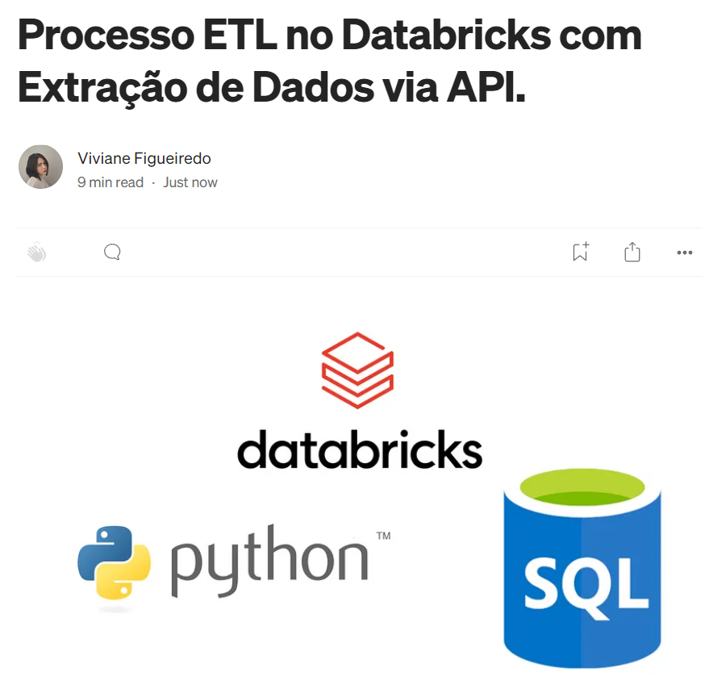

# ETL-Databricks
Neste pequeno projeto, demonstro um processo de ETL (Extract, Transform, Load), focando especialmente na extração de informações por meio de uma API (Application Programming Interface). Ao final deste trabalho teremos realizado, utilizando Python, a extração e tratamento das informações obtidas, e por fim, gerado um banco de dados SQL onde as informações serão incorporadas. Tal projeto foi desenvolvido na plataforma Databricks.

Para mais detalhes sobre o projeto você pode acessar o meu artigo no Medium clicando na imagem abaixo.

